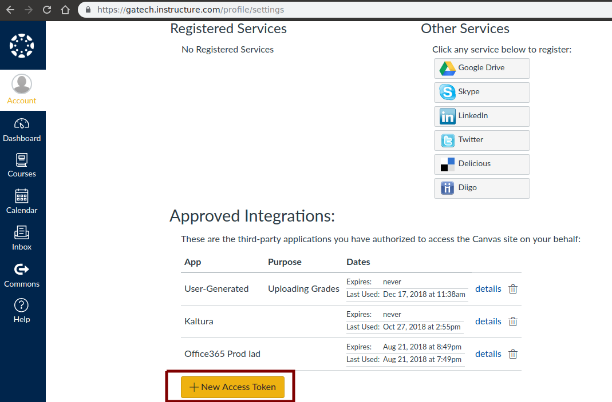

# Canvas Utility Scripts
This repository includes some scripts that I developed for grading PDF submissions and uploading grades to the [Georgia Tech Canvas](https://gatech.instructure.com/), as a TA for CSE 6140 (CSE Algorithms) taught by Prof. Umit Catalyurek in Fall 2018.

* <code>grade_pdfs.py</code> can be used for quickly grading multiple PDF submissions. I found it especially useful for the above mentioned class because of the large number of students enrolled in the class.
* <code>upload_grades.py</code> can be used for uploading grades and comments for multiple students to Canvas. I have only tested the script with the GaTech Canvas but I surmise it should be useful more generally. This requires a <code>config.json</code> with a valid access token, which can be generated from _Account > Settings > New Access Token_ as shown below.

